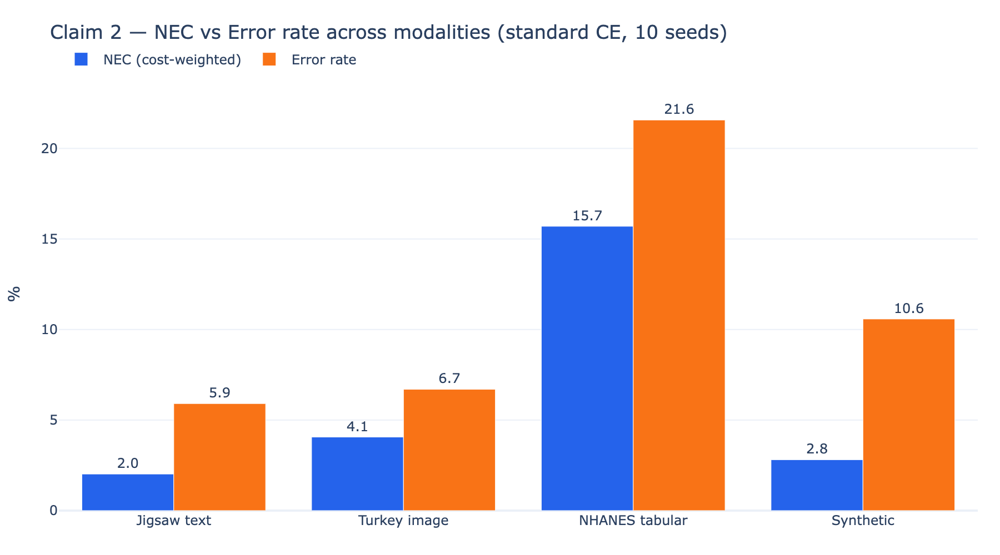

# Reproduction — *Instance-Level Costs for Nuanced Classifier Evaluation*

An agent-driven, independent reproduction of Kang & Mussmann's ICML 2026 paper
[#31878](https://openreview.net/forum?id=qMI1xD8O3x) ([arXiv:2605.03135](https://arxiv.org/abs/2605.03135)) for the HF × AlphaXiv ICML-2026 agent reproduction challenge.

The paper defines **Normalized Excess Cost (NEC)**: classification errors weighted
by each example's cost `|Δ|`. With uniform costs, NEC equals ordinary error rate.
This repository tests that mechanism and selected training claims on public text,
image, and tabular inputs. It is not an official implementation or a peer review.



*Mean test-split metrics across 10 seed-specific splits. Error rate ÷ NEC is 2.92×
for Jigsaw, 1.65× for Turkey (any-injury definition), and 1.37× for NHANES.
Synthetic is this repository's control and is not a numerical reproduction of the
paper. The underlying chart is [`outputs/figures/crossmodal.html`](outputs/figures/crossmodal.html).*

## Try it

The data-free smoke tests exercise the metric identity and deterministic sampling:

```bash
pip install numpy pandas scikit-learn scipy pytest
pytest -q
```

To run experiments, use the lockfile-backed environment. The commands download
source data and replace the corresponding committed result CSVs, so run them from
a disposable working copy if you want to retain the historical outputs unchanged.

```bash
uv sync
uv run python scripts/prepare_jigsaw.py
JIGSAW_N=300000 uv run python scripts/run_jigsaw_tfidf.py
uv run python scripts/run_nhanes.py
uv run python scripts/run_turkey.py
uv run python scripts/run_synthetic.py
uv run python scripts/run_synthetic_sweep.py
uv run python scripts/run_cost_derivation.py
uv run python scripts/paired_regression_stats.py
```

`run_turkey_finetune.py` is a reduced-scale MPS probe, not a reproduction of the
paper's GPU fine-tuning result. See [reproduction notes](docs/reproducing.md) for
inputs, outputs, and the limits of each run.

## Results and scope

| Paper claim | Result in this repository | Scope and limit |
| --- | --- | --- |
| Jigsaw has a large error-rate/NEC gap | 2.02% NEC and 5.91% error (2.92×) | 300k stratified subsample; train-only TF-IDF fit; 10 splits |
| Gap occurs across modalities | Turkey: 1.65×; NHANES: 1.37× | Turkey uses frozen ResNet-50; iNaturalist cannot be evaluated because the paper's ratings are unavailable |
| Three cost sources | Vote-margin and threshold-distance costs run on real data | Direct ratings are a synthetic demonstration only |
| Cost-weighted training | Partial: Turkey −11.6%, NHANES −1.9%, Jigsaw +11.4% relative NEC | The Jigsaw and synthetic patterns differ from the paper |
| Δ-regression | Jigsaw MAE 0.325; observed paired split differences are small | Repeated seed splits overlap, so nominal t intervals are descriptive, not population inference |
| Fine-tuned results | Not reproduced | Three-seed Turkey top-block MPS probe is exploratory only |

Result tables are versioned in [`outputs/`](outputs/). The current results are a
historical run record: a rerun is expected to regenerate outputs, but has not been
shown bitwise identical across environments. [`outputs/master_results.csv`](outputs/master_results.csv)
keeps the paper-side comparison; [`outputs/claim6_paired.csv`](outputs/claim6_paired.csv)
contains the paired split summaries.

The Jigsaw vote counts are reconstructed from the dataset's aggregate toxicity
fraction and annotator count (`round(toxicity × count)`), rather than obtained as
individual votes; see [`scripts/prepare_jigsaw.py`](scripts/prepare_jigsaw.py).

## Repository map

```
src/nec.py             NEC, cost derivations, splits, and training strategies
scripts/               one executable script per experiment and figure
tests/                 data-free metric and sampling checks
outputs/               committed historical result CSVs and figures
docs/reproducing.md    data sources, commands, outputs, and known limits
docs/research-log/     portable index of the original experiment log
docs/poster/           archived poster exports and source assets
data/                  downloaded inputs and caches (ignored)
```

## Evidence and artifacts

- [Reproduction notes](docs/reproducing.md) map every command to its inputs and outputs.
- [Research-log index](docs/research-log/README.md) preserves the useful experiment record while keeping the original Trackio export local.
- [Archived poster artifacts](docs/poster/README.md): the [preview](docs/poster/poster_preview.png) and [PDF](docs/poster/poster_preview.pdf) are historical exports with superseded significance wording; the [HTML source](docs/poster/poster.html) is revised to describe the paired result without population inference.
- `manifest.sha256` hashes the published payload files; run `shasum -a 256 -c manifest.sha256` to check them.
- The challenge's automated Logbook Judge reported the headline NEC/error claim as `verified` and the weighting claim as `inconclusive`; this is challenge automation, not peer review: [public verdicts](https://huggingface.co/datasets/ICML-2026-agent-repro/verdicts).

## Data, license, and attribution

The scripts retrieve Jigsaw from Hugging Face, Turkey/DCIC from Zenodo
([10.5281/zenodo.8115942](https://doi.org/10.5281/zenodo.8115942)), and NHANES
2013–2014 from the CDC. Raw source archives and large derived inputs are excluded.
The small `outputs/nhanes/nhanes_prepared.csv` table is a derived research output
and remains subject to the source data's terms. Details are in
[`DATA_NOT_INCLUDED.md`](DATA_NOT_INCLUDED.md) and [`NOTICE`](NOTICE).

The MIT license applies to the reproduction code and analysis authored here. The
paper and datasets retain their own terms. Cite the original paper and data sources
in downstream work.
